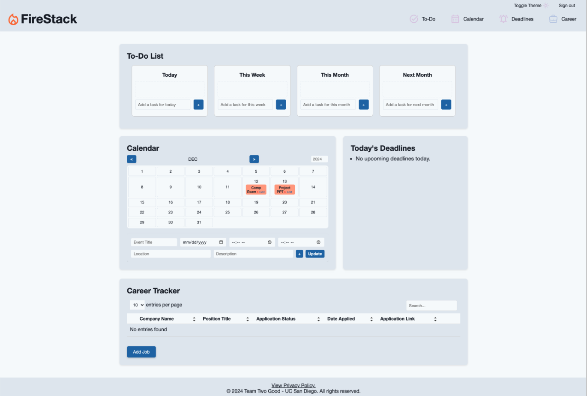

# cse210-fa24-group2
[](https://app.codacy.com?utm_source=gh&utm_medium=referral&utm_content=&utm_campaign=Badge_grade)

# Introduction

[View our live site here.](https://cse210-fa24-group2.onrender.com/)
*Please note that the site is hosted on a free version of Render, so it may take a few minutes to load if it hasn’t been accessed in the last 15 minutes.*

FireStack is a robust and user-friendly productivity application integrating task management, calendar synchronization, and job tracking into a seamless interface. The app connects with Google Calendar to provide a unified experience for managing schedules and deadlines, making it ideal for CS students seeking success in their courses, personal projects, and internship search.


*This is a sample view of our dashboard.*

## **Table of Contents**
1. [Features](#features)  
2. [Usage](#usage)  
3. [Tech Stack](#tech-stack)  
4. [Repo Organization](#repo-organization)  
5. [Setup & Installation](#setup--installation)  
6. [API Endpoints](#api-endpoints)  
7. [Contributing](#contributing)  
8. [CI / CD Pipeline for FireStack](#ci--cd-pipeline-for-firestack)  

# Features

## To-do List
The first feature that appears on the dashboard is to the to-do list. This is a space to outline and organize tasks by urgency of completion. We offer 4 bins to separate tasks into:
1. Today's Tasks
2. This Week's Tasks
3. This Month's Tasks
4. Next Month's Tasks

- **To add tasks into each respective bin**, type a task into the space that says `Add a task...` and then either click the blue `+` button or press the `return` key on the keyboard.

- **To remove tasks**, press the red `x` button on the right side of the task. 

- **To move a task from one bin to another**, drag the task and drop it in the desired bin when a faint blue background appears on hover. Tasks added to another bin will always be appended. 

*If many tasks (7+) are added to a single bin, scroll within the bin to see all the tasks.* 


## Calendar
The calendar is a tracking tool that allows for clear visualization of deadlines, meetings, or any other entered events.

Events on this calendar are shared with a user's Google Calendar. Any event from Google Calendar will appear here, and any event added here will also appear on Google Calendar. 

- **To add an event**, fill out the key information (i.e. event title and date/time) located at the bottom of this feature and press the `+` button if this is a new event or `update` button if this is an existing task. 

- **To change the month view**, press either the `<` or `>` button to go back or forward one month, respectively. **To change the year view**, enter the desired year in the box on the top right corner that stores the current year. 

- **To edit an event**, press the `edit` button on the event. If it needs to be deleted, press the red `x` button. *This will remove the event both from this calendar view as well as the user's Google Calendar.* 


## Upcoming Deadlines
Anything with a deadline set as today will be displayed here. This section fetches today's events from the:
- calendar section
- career tracker section

 
## Career Tracker
This section serves to organize and track internship/job applications. 

- **To add a job to track**, click the `Add Job` button to fill out a form with relevant info on a job application (i.e. company name, position, date applied) and click `Save` to add the details to the tracker. 

- **To edit job app details**, click the **pencil** icon that appears on the right side of the job application in the tracker. 

- **To remove a job app from the tracker**, click the big red `x` button the appears besides the pencil icon for that job application - *user will be asked to confirm whether this job application's details are to be removed.* 

- **To search for a job app**, enter desired keyword (can be related to company name, position title, application status, date applied or application link) in the search bar that appears on the right upper corner of this feature. The search will reveal any relevant applications.

- **To change the number of entries viewed** on the page, the user can select a desired number from the drop down button in the upper left corner, next to where it says `entries per page`. *We currently offer users to view 5, 10, 15, 20, and 25 entries per page.* 

## Additional Functionality
- This application is compatible with large screens as well as smallers screens (such as those on mobile devices).

- To accomodate for different user tastes in site colors, we incorporated both a light mode and dark mode, which can be switched into by clicking the `Toggle Theme` button on the top right corner of the webpage.

- Additionally, the navigation bar allows users to jump to a particular section in the webpage.


# Usage
To use FireStack, follow these steps:
1. **Visit the Application**: Open [FireStack](https://cse210-fa24-group2.onrender.com/) in your browser. Allow some time for the app to load if it has been inactive.
2. **Sign In**: Use Google OAuth to securely sign in with your Google account. Once authenticated, you will be redirected to the dashboard.
3. **Explore Features**:
   - **To-Do List**: Organize tasks by urgency (Today, This Week, This Month, Next Month). Add, edit, move, or delete tasks with ease. 
   - **Calendar**: Add or modify events that sync directly with your Google Calendar. Navigate through months and years with simple controls. 
   - **Upcoming Deadlines**: View deadlines for tasks and events scheduled for today.
   - **Career Tracker**: Add and track internship or job applications, edit details, and search or filter entries.
4. **Switch Themes**: Toggle between light and dark mode using the `Toggle Theme` button in the top-right corner.
5. **Navigation**: Use the navigation bar to jump to specific sections of the app (e.g., To-Do List, Calendar, Career Tracker).
6. **Save Your Progress**: All tasks, calendar events, and career tracker entries are automatically saved and synced with your Google account.

# Tech Stack
FireStack is built using a well-structured tech stack that ensures performance, scalability, and maintainability. Below is a detailed breakdown of the technologies used:

## **Languages**
- **Python**: Primary language for backend logic and API integration.
- **JavaScript**: Used for client-side interactivity and DOM manipulation.
- **CSS**: For styling and layout of the application.
- **HTML**: For structuring the frontend components.

## **Backend Framework**
- **Flask**: A lightweight and versatile web framework that powers the server-side logic and API endpoints.

## **Database**
- **PostgreSQL**: A powerful and reliable relational database, accessed via SQLAlchemy, for storing and managing application data.

## **APIs**
- **Google OAuth**: Used for secure user authentication.
- **Google Calendar API**: Enables synchronization of events between FireStack and Google Calendar.

## **Other Tools and Libraries**
- **SQLAlchemy**: ORM (Object Relational Mapper) for interacting with the PostgreSQL database.
- **Render**: Hosting platform for deploying the application.
- **Codacy**: Integrated for static code analysis and maintaining code quality.

# Repo Organization
```scss
cse210-fa24-group2/
├── static/
│   ├── assets/       
│   │   ├── icons/    # logo and symbols for features
│   │   ├── images/   # miscellaneous images for readme, etc.
│   │   ├── navbar/   # used for navigation bar when screen shrinks
│   ├── css/
│   │   ├── 404.css                 # error message formatting
│   │   ├── InternshipTracker.css   # career tracking feature formatting
│   │   ├── calendar.css            # calendar feature formatting
│   │   ├── signIn.css              # login formatting
│   │   ├── styles.css              # overall dashboard formatting
│   │   ├── todo.css                # todo list formatting
│   │   ├── vars.css                # global vars for color formatting
│   ├── js/                         # javascripts for all the features functionalities and more
│       ├── Calendar.js
│       ├── InternshipTracker.js
│       ├── app.js
│       ├── dateUtils.js
│       ├── privacy.js              # script for theme toggle button        
│       ├── script.js               # script for logout and theme toggle buttons
│       ├── signIn.js
│       ├── todoList.js
│       ├── upcomingDeadlines.js
├── src/
│   ├── app.py
│   ├── calendarGoogle.py
│   ├── client_secret.json
```

# Setup & Installation

# API Endpoints

This document provides an overview of the API endpoints available in our application. The API is built using Flask and integrates with Google OAuth 2.0 for authentication, PostgreSQL for data storage, and Google Calendar API for event management.

## Authentication

### Login
- **URL**: `/login`
- **Method**: `GET`
- **Description**: Initiates the Google OAuth 2.0 login process.
- **Response**: Redirects the user to Google's OAuth 2.0 authorization URL.

### Callback
- **URL**: `/callback`
- **Method**: `GET`
- **Description**: Handles the Google OAuth 2.0 callback, verifies the user, and stores session details.
- **Response**: Redirects to the dashboard upon successful login.

### Logout
- **URL**: `/logout`
- **Method**: `GET`
- **Description**: Logs out the user and clears the session.
- **Response**: Redirects to the home page.

---

## Internship Management

### Add Internship
- **URL**: `/api/internships`
- **Method**: `POST`
- **Description**: Adds a new internship entry to the database.
- **Authentication**: Required
- **Request Body**: JSON object with internship details
- **Response**:
  - **Success**: JSON object with message and internship ID (Status 201)
  - **Error**: JSON object with error message (Status 400 or 500)

### Update Internship
- **URL**: `/api/internships/<internship_id>`
- **Method**: `PUT`
- **Description**: Updates an existing internship entry.
- **Authentication**: Required
- **Parameters**: `internship_id` (integer)
- **Request Body**: JSON object with updated internship details
- **Response**:
  - **Success**: JSON object with success message (Status 200)
  - **Error**: JSON object with error message (Status 404 or 500)

### Delete Internship
- **URL**: `/api/internships/<internship_id>`
- **Method**: `DELETE`
- **Description**: Deletes an internship entry.
- **Authentication**: Required
- **Parameters**: `internship_id` (integer)
- **Response**:
  - **Success**: JSON object with success message (Status 200)
  - **Error**: JSON object with error message (Status 404 or 500)

### Get Today's Internships
- **URL**: `/api/internships/today`
- **Method**: `GET`
- **Description**: Fetches internships with follow-up dates matching today's date.
- **Authentication**: Required
- **Response**:
  - **Success**: JSON array of internship objects (Status 200)
  - **Error**: JSON object with error message (Status 500)

---

## Todo List Management

### Get Todos
- **URL**: `/api/todos`
- **Method**: `GET`
- **Description**: Fetches all todos for the logged-in user.
- **Authentication**: Required
- **Response**:
  - **Success**: JSON object with an array of todo items (Status 200)
  - **Error**: JSON object with error message (Status 404)

### Add Todo
- **URL**: `/api/todos`
- **Method**: `POST`
- **Description**: Adds a new todo for the logged-in user.
- **Authentication**: Required
- **Request Body**: JSON object with category and task
- **Response**:
  - **Success**: JSON object with the added todo details (Status 200)
  - **Error**: JSON object with error message (Status 400 or 500)

### Delete Todo
- **URL**: `/api/todos/<todo_id>`
- **Method**: `DELETE`
- **Description**: Deletes a todo by ID for the logged-in user.
- **Authentication**: Required
- **Parameters**: `todo_id` (integer)
- **Response**:
  - **Success**: JSON object with success message (Status 200)
  - **Error**: JSON object with error message (Status 404 or 500)

### Update Todo Category
- **URL**: `/api/todos/<todo_id>/category`
- **Method**: `PATCH`
- **Description**: Updates the category of a todo by ID for the logged-in user.
- **Authentication**: Required
- **Parameters**: `todo_id` (integer)
- **Request Body**: JSON object with category
- **Response**:
  - **Success**: JSON object with success message (Status 200)
  - **Error**: JSON object with error message (Status 400 or 500)

---

## Calendar Management

### Get Events
- **URL**: `/api/calendar/events`
- **Method**: `GET`
- **Description**: Fetches Google Calendar events for the user.
- **Authentication**: Required
- **Response**:
  - **Success**: JSON array of event objects (Status 200)
  - **Error**: JSON object with error message (Status 500)

### Create Event
- **URL**: `/api/calendar/events`
- **Method**: `POST`
- **Description**: Creates a new Google Calendar event.
- **Authentication**: Required
- **Request Body**: JSON object with event details
- **Response**:
  - **Success**: JSON object with created event details (Status 201)
  - **Error**: JSON object with error message (Status 400 or 500)

### Update Event
- **URL**: `/api/calendar/events/<event_id>`
- **Method**: `PUT`
- **Description**: Updates an existing Google Calendar event.
- **Authentication**: Required
- **Parameters**: `event_id` (string)
- **Request Body**: JSON object with updated event details
- **Response**:
  - **Success**: JSON object with updated event details (Status 200)
  - **Error**: JSON object with error message (Status 500)

### Delete Event
- **URL**: `/api/calendar/events/<event_id>`
- **Method**: `DELETE`
- **Description**: Deletes an existing Google Calendar event.
- **Authentication**: Required
- **Parameters**: `event_id` (string)
- **Response**:
  - **Success**: JSON object with success message (Status 200)
  - **Error**: JSON object with error message (Status 500)

### Get Today's Events
- **URL**: `/api/calendar/events/today`
- **Method**: `GET`
- **Description**: Fetches Google Calendar events for the current day in the user's time zone.
- **Authentication**: Required
- **Response**:
  - **Success**: JSON array of event objects (Status 200)
  - **Error**: JSON object with error message (Status 500)


# Contributing
Contributions are welcome! Before contibuting, please take a look at our documentation on best practices, paying close attention to our [Code Alignment Documentation](admin/bestPractices/codeArchitecture.md) and our [Frontend Design System](admin/bestPractices/frontendDesignSystem.md). Please follow the steps below to contribute:
1. Fork the repository.
2. Create a new branch `git checkout -b feature-name`.
3. Commit your changes `git commit -m 'Add feature-name'`.
4. Push to the branch `git push origin feature-name`.
5. Create a pull request, following the instructions in our pull request process document [here](admin/bestPractices/pullRequestProcess.md), and use our pull request template [here](admin/templates/githubPullRequestTemplate.md).

If you see any errors, please let us know. To add an issue, use our template [here](admin/templates/githubIssueTemplate.md).

# CI / CD Pipeline for FireStack

This repository includes a comprehensive CI/CD pipeline designed to ensure the continuous integration and deployment of FireStack. The pipeline automates setup, code quality checks, testing, static analysis, and deployment workflows, enabling a robust development lifecycle.
[Code for CI/CD](https://github.com/cse210-fa24-group2/cse210-fa24-group2/blob/main/.github/workflows/ci-cd.yml)

## CI / CD Pipeline

### Trigger Events
The pipeline triggers on the following events:
- **Push**: Executes on any push to the `main` branch.
- **Pull Request**: Executes for pull requests targeting the `main` branch.

### Jobs

#### 1. **Setup**
Sets up the environment to prepare for subsequent jobs. This includes:
- Checking out the code from the repository.
- Setting up Python 3.8.
- Installing Python dependencies and additional tools like `black`, `flake8`, `pylint`, `coverage`, `jest`, `jsdoc`, `cypress`, and `eslint`.
- Configuring environment variables using repository secrets.

#### 2. **JSDocs**
Generates and pushes JavaScript documentation to the `docs` branch.
- Generates JSDocs using `jsdoc.json`.
- Commits and pushes changes to the `docs` branch if updates are detected.
- [JSDocs can be viewed here.](https://github.com/cse210-fa24-group2/cse210-fa24-group2/tree/docs/jsdocs)

#### 3. **Linting and Code Quality**
Performs code linting and quality checks for Python and JavaScript:
- Python:
  - Checks formatting with `black`.
  - Runs `flake8` and `pylint` for linting.
- JavaScript:
  - Lints code using `eslint`.
- Codacy:
  - Analyzes Python and JavaScript code for quality using the Codacy CLI.

#### 4. **Static Analysis**
Conducts a static code analysis using ESLint and plugins:
- Installs additional plugins (`eslint-plugin-security` and `eslint-plugin-jsdoc`).
- Performs static analysis on all JavaScript, TypeScript, and JSX/TSX files.
- Uploads static analysis reports as artifacts.

#### 5. **Testing**
Runs automated tests to ensure the integrity of the application:
- Python:
  - Executes unit tests with `unittest` and generates coverage reports using `coverage`.
- JavaScript:
  - Runs unit tests using `jest` with coverage enabled.
- End-to-End Tests:
  - Executes end-to-end tests using manual testing.
- Uploads coverage reports as artifacts.
- Uploads coverage data to Codacy for detailed reporting here: [](https://app.codacy.com?utm_source=gh&utm_medium=referral&utm_content=&utm_campaign=Badge_grade)

#### 6. **Optimization**
Minimizes CSS and JavaScript files for improved performance:
- Minifies files in the `static/css` and `static/js` directories using `clean-css-cli` and `terser`.
- Uploads the optimized files as artifacts.

## Repository Secrets
The pipeline requires the following secrets for secure operations:
- `FLASK_SECRET_KEY`
- `GOOGLE_CLIENT_ID`
- `GOOGLE_CLIENT_SECRET`
- `REDIRECT_URI`
- `GITHUB_TOKEN`
- `CODACY_PROJECT_TOKEN`
- `RENDER_API_KEY`

Ensure these secrets are configured in the repository settings before running the pipeline.

## Notes
- **[skip ci]**: Commits with this tag in the message will skip pipeline execution.
- The pipeline ensures modular and reusable workflows, optimizing development efficiency.

For any questions or issues, please contact the repository maintainers.
