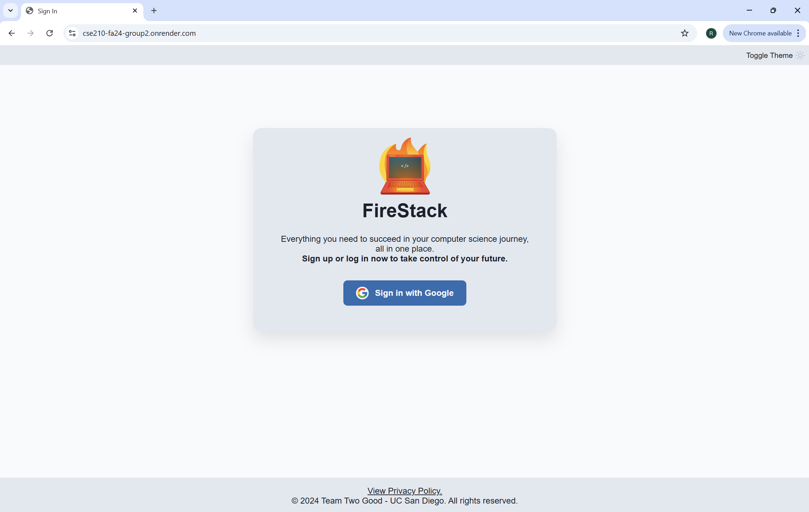

# Testing Documentation for FireStack Application

### Team Two

---

## Objective
Due to integrations with Google OAuth verification and Google Calendar APIs, end-to-end testing was not feasible for this project. Google’s stringent privacy policies and the requirement for app verification significantly complicated the testing process. Our app is not yet verified, and the verification process, which ensures compliance with Google's privacy standards, typically takes 4 to 6 weeks. Without verification, the automated OAuth flow remains restricted, preventing seamless automated testing of authentication and API interactions. These limitations made it impractical to implement automated end-to-end tests for the application. As an alternative, comprehensive manual testing was conducted to validate the functionality, usability, and overall performance of the FireStack application.

---

## Unit Testing
In addition to Manual testing, we have implemented Unit testing for our web application. In this project, we undertook extensive unit testing to ensure the functionality, reliability, and robustness of individual components. Unit tests were focused on core modules such as the Flask application, Google Calendar integration, to-do list functionality, and career tracking system. The primary goal of these tests was to validate the correctness of each feature in isolation, simulate edge cases, and verify system behavior under controlled conditions.

- The Flask application underwent rigorous testing through test_app.py. This included verifying the functionality of routes like the home page, login, dashboard, and logout. Mocking techniques were extensively used to simulate external dependencies, such as the database session and Google OAuth authentication. The logout functionality was tested to ensure session clearance and redirection.

- For the Google Calendar module, test_calendar.py validated the integration with Google Calendar APIs. Mocking was utilized to test event creation, deletion, and retrieval from the calendar without actual interaction with Google’s servers. Tests ensured that events were correctly structured and HTTP responses were properly handled. This allowed us to verify that the system behaved as expected when interacting with external APIs while maintaining data integrity.

- The to-do list functionality was tested in test_todo.py by simulating operations such as adding, updating, and deleting tasks. Mock database sessions were used to ensure isolation, enabling us to test the endpoints without depending on a live database. This approach validated task management capabilities while ensuring no actual data was altered. Additionally, invalid input scenarios were tested to ensure proper handling of errors and robust validation mechanisms.

- Furthermore, test_career_tracker.py focused on testing the career tracker system's API endpoints. It included tests for adding, updating, and fetching internship data, with mock sessions simulating authenticated users. This allowed for verifying data manipulation operations and ensuring that all API responses aligned with the expected behavior.

- On the front-end side, Jest was used for testing modules like the calendar and to-do list. In Calendar.test.js, we verified CRUD operations for calendar events and ensured the calendar’s rendering logic was accurate. Similarly, todoList.test.js tested to-do list interactions, such as task addition, deletion, and validation of user inputs. By mocking the DOM and API responses, we ensured seamless operation of front-end components under different scenarios.

These unit tests not only helped us identify and address bugs early in development but also provided a strong foundation for understanding the functionality of each module. By covering various edge cases and utilizing mocks, we ensured that the system was thoroughly tested in isolation, which greatly enhanced confidence in the application's reliability.

---

## Testing Environment
- **Browser:** Google Chrome Version (130.0.6723.119)  
- **Operating System:** Windows 10  
- **Deployed Application:** Hosted at https://cse210-fa24-group2.onrender.com
- **Network:** Stable internet connection to ensure Google API access  

---

## Test Plan and Steps

The testing process focused on the following key features, with both positive and negative test cases:

1. **Authentication**  
2. **To-Do List Functionality**  
3. **Calendar Integration**  
4. **Career Tracker**  
5. **Theme Toggle (Light/Dark Mode)**  
6. **Upcoming Deadlines Section**

For each feature, detailed steps, expected results, actual results, and screenshots were recorded.

### 1. Authentication
**Test Case:** Google OAuth 2.0 Login and Logout  

**Positive Test Steps:**
1. Navigate to the FireStack home page.
2. Click the "Sign in with Google" button.
3. Authenticate with a valid Google account.
4. Verify that the user is redirected to the dashboard upon successful login.
5. Test logout by clicking the "Sign Out" button in the top-right corner.

**Expected Result:** Successful login should display the dashboard, and logout should redirect to the home page.  

**Negative Test Steps:**
1. Click the "Sign in with Google" button and close the authentication window without completing the login.
2. Attempt to log in with invalid Google credentials.
3. Test accessing /dashboard directly without logging in.

**Expected Negative Result:**
- Login should fail with proper error handling.
- Direct access to protected routes should show a "401 Unauthorized" error.

**Actual Results:**
- Positive cases worked as expected.
- Negative cases were handled correctly, with appropriate error messages displayed.

---

### 2. To-Do List Functionality
**Test Case:** Adding, Deleting, and Categorizing Tasks  

**Positive Test Steps:**
1. Navigate to the dashboard.
2. Add a task in the "Today" category by typing in the input field and clicking the "+" button.
3. Add tasks in "This Week," "This Month," and "Next Month" categories.
4. Verify that tasks appear under their respective categories.
5. Delete a task using the "×" button next to the task.

**Expected Result:** Tasks should be added, displayed, and deleted appropriately.  

**Negative Test Steps:**
1. Attempt to add an empty task (leave the input field blank and click the "+" button).
2. Delete a task and verify.

**Expected Negative Result:**
- Empty tasks should not be added.

**Actual Results:**
- Positive cases passed.
- Negative cases handled appropriately.

---

### 3. Calendar Integration
**Test Case:** Event Creation and Navigation  

**Positive Test Steps:**
1. Navigate to the calendar section on the dashboard.
2. Add a new event by entering the title, date, start time, end time, location, and description, then click the "Update" button.
3. Verify the event appears on the calendar.
4. Test navigation by switching between months.

**Expected Result:** Events should be created and displayed on the calendar, and navigation should work seamlessly.  

**Negative Test Steps:**
1. Add an event without a title or with invalid date/time inputs (e.g., end time earlier than start time).

**Expected Negative Result:**
- Invalid events should not be created.

**Actual Results:**
- Positive cases passed.
- Negative cases were handled correctly with appropriate error messages.

---

### 4. Career Tracker
**Test Case:** Internship Data Management  

**Positive Test Steps:**
1. Add a new internship entry using the provided input fields.
2. Verify that the entry appears in the table.
3. Test search functionality by typing keywords in the search bar.
4. Test deleting an entry using the delete button.

**Expected Result:** Internships should be added, displayed, searched, and deleted successfully.  

**Negative Test Steps:**
1. Try searching with invalid or unrelated keywords.

**Expected Negative Result:**
- Unrelated search keywords should return no results without errors.

**Actual Results:**
- Positive cases passed successfully.
- Negative cases were handled as expected.

---

### 5. Theme Toggle
**Test Case:** Light and Dark Mode Switching  

**Positive Test Steps:**
1. Test the toggle switch for switching between Light and Dark modes.
2. Verify that all components adapt to the selected theme.

**Expected Result:** The application should switch seamlessly between Light and Dark modes, maintaining readability and usability.  

**Negative Test Steps:**
1. Attempt rapid toggling between themes and observe behavior.
2. Test theme toggle functionality with slow or interrupted network conditions.

**Expected Negative Result:**
- Rapid toggling should not cause UI glitches.
- Slow network conditions should not affect theme toggling.

**Actual Results:**
- Positive cases worked perfectly.
- Negative cases demonstrated no UI or performance issues.

---

### 6. Upcoming Deadlines Section
**Test Case:** Display of Upcoming Events and Internship Follow-Up Deadlines  

**Positive Test Steps:**
1. Navigate to the "Upcoming Deadlines" section on the dashboard.
2. Verify that all upcoming events from the calendar (e.g., today's events) are displayed with the correct details (event name and time).
3. Add a new calendar event with today's date and check if it appears in the "Upcoming Deadlines" section.
4. Add an internship with today's date as the follow-up date and check if its Company Name and Position Title appear in the "Upcoming Deadlines" section.

**Expected Result:**
- Upcoming deadlines should display events correctly with their name and time.
- Internships with today's follow-up date should display the company name and position title dynamically.

**Negative Test Steps:**
1. Add an event with missing details (e.g., no title or time) and verify it does not appear in the "Upcoming Deadlines" section.
2. Add a past event and check if it appears in the "Upcoming Deadlines" section.
3. Add an internship with a follow-up date in the past and verify it does not appear.

**Expected Negative Result:**
- Events with incomplete details should not appear.
- Past events and internships should not be displayed in the "Upcoming Deadlines" section.

---

## Observations and Screenshots

### 1. Authentication

- **Image 1 (Before):** The login page showing the "Sign in with Google" button. 

  

- **Image 2 (After):** The dashboard immediately after login, displaying the user's interface. 

  

---

### 2. To-Do List Functionality

- **Image 3 (Before):** A blank "Today" category with no tasks. 

  

- **Image 4 (After):** A task added to the "Today" category, showing the updated list with the new task. 

  

---

### 3. Calendar Integration and Upcoming Deadlines

- **Image 5 (Before):** The calendar and "Upcoming Deadlines" section before adding an event or deadline (both sections blank). 

  

- **Image 6 (After):** The calendar and "Upcoming Deadlines" section after adding: 
  - A calendar event (e.g., SWE Finals 3). 
  - An internship follow-up deadline (e.g., Company Name and Position Title displayed under "Upcoming Deadlines"). 

  

---

### 4. Internship Career Tracker

- **Image 7 (Before):** The Career Tracker table empty. 

  

- **Image 8 (After):** The Career Tracker after adding an internship, showing: 
  - The company name. 
  - The position title. 
  - The delete and edit options. 

  

---

## Conclusion
Manual testing confirmed that the core functionalities of FireStack are fully operational and robust. Both positive and negative cases were handled as expected. The application demonstrated reliability across authentication, to-do list management, calendar events, career tracker, and theme toggle functionalities.